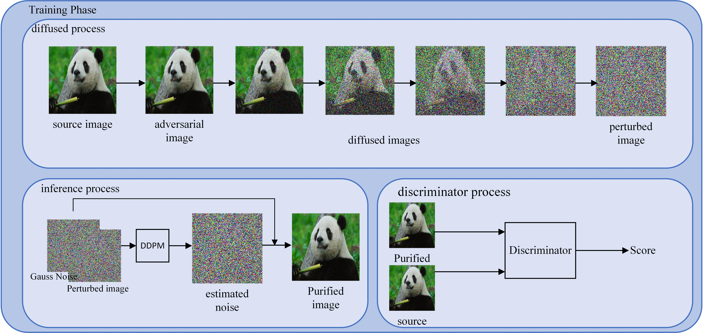

# PyTorch APDDPM: Adversarial Purification through Denoise Diffusion Probabilistic Model Training via GANs



## Installation
```
$ conda env create --name apddpm --file environment.yml
$ conda activate apddpm
```


## Run Experimental of trained model in other model
```python
python Script_robustbench.py
```
The script '''Script_robustbench.py''' executes the models provided by RobustBench, which are pre-trained models designed to exhibit a certain level of robustness.

```python
python Script_us.py
```

The script '''Script_us.py''' is likely designed to run models that have been trained using the standard training procedure, without specific emphasis on robustness.


With the exception of the models from RobustBench, all other models utilized in the paper have been uploaded to Google Drive.


